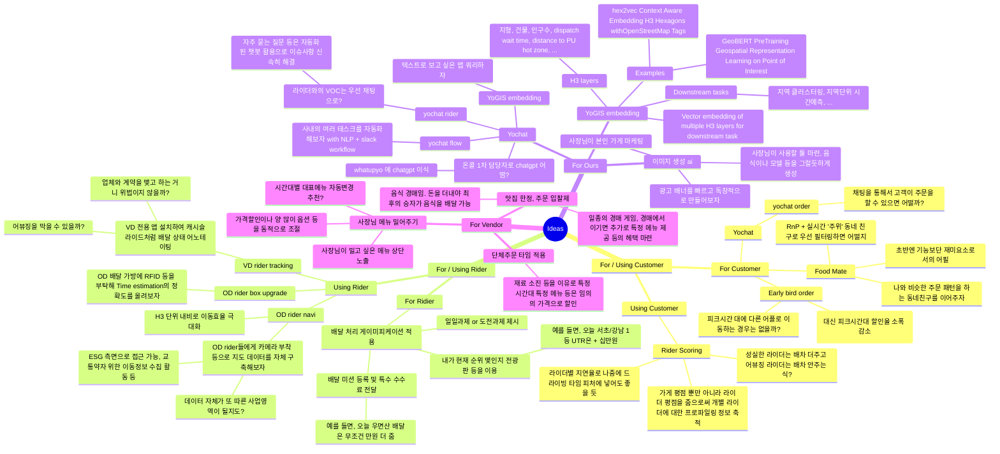

# what for?

# Idea Mindmap

```mermaid
mindmap
  root((Ideas))
    For / Using Customer
      For Customer
        Early bird order
          식사 시간대 초입과 끝즘에 할인율을 더 높여 수요 분산 (대신 피크시간대 할인율 소폭 감소)
          피크시간 대에 다른 어플로 이동하는 경우는 없을까?
        Food Mate
          나와 비슷한 주문 패턴을 하는 동네친구를 이어주자
          초반엔 기능보단 재미요소로서의 어필
          RnP + 실시간 '주위' 동네 친구로 우선 필터링하면 어떨지
        Yochat
          yochat order
            채팅을 통해서 고객이 주문을 할 수 있으면 어떨까?
      Using Customer
        Rider Scoring
          가게 평점 뿐만 아니라 라이더 평점을 줌으로써 개별 라이더에 대한 프로파일링 정보 축적
          성실한 라이더는 배차 더주고 어뷰징 라이더는 배차 안주는 식?
          라이더별 지연율로 나중에 드라이빙 타임 피처에 넣어도 좋을 듯
      
        
    For / Using Rider
      For Ridier
        배달 처리 게이미피케이션 적용
          일일과제 or 도전과제 제시
          내가 현재 순위 몇인지 전광판 등을 이용
            예를 들면, 오늘 서초/강남 1등 UTR은 + 십만원
          배달 미션 등록 및 특수 수수료 전달
            예를 들면, 오늘 우면산 배달은 무조건 만원 더 줌
      Using Rider
        OD rider navi
          H3 단위 내비로 이동효율 극대화
          OD rider들에게 카메라 부착 등으로 지도 데이터를 자체 구축해보자
            데이터 자체가 또 따른 사업영역이 될지도?
            ESG 측면으로 접근 가능, 교통약자 위한 이동정보 수집 활동 등
        OD rider box upgrade
          OD 배달 가방에 RFID 등을 부탁해 Time estimation의 정확도를 올려보자
        VD rider tracking
          VD 전용 앱 설치하여 캐시슬라이드처럼 배달 상태 어노테이팅
            어뷰징을 막을 수 있을까?
            업체와 계약을 맺고 하는 거니 위법이지 않을까?

    For Ours
        이미지 생성 ai
            광고 배너를 빠르고 독창적으로 만들어보자
            사장님이 본인 가게 마케팅
            사장님이 사용할 툴 마련, 음식이나 모델 등을 그럴듯하게 생성
        Yochat
            온콜 1차 담당자로 chatgpt 어떰?
                whatupyo 에 chatgpt 이식
            yochat flow
                사내의 여러 태스크를 자동화해보자 with NLP + slack workflow
            yochat rider
                라이더와의 VOC는 우선 채팅으로?
                    자주 묻는 질문 등은 자동화된 챗봇 활용으로 이슈사항 신속히 해결
            YoGIS embedding
                텍스트로 보고 싶은 맵 쿼리하자
        YoGIS embedding 
            Vector embedding of multiple H3 layers for downstream task 
            H3 layers
                지형, 건물, 인구수, dispatch wait time, distance to PU hot zone, ...
            Downstream tasks 
                지역 클러스터링, 지역단위 시간예측, ...
            Examples
                GeoBERT PreTraining Geospatial Representation Learning on Point of Interest
                hex2vec Context Aware Embedding H3 Hexagons withOpenStreetMap Tags

    For Vendor
      사장님 메뉴 밀어주기
        사장님이 밀고 싶은 메뉴 상단노출
        가격할인이나 양 많이 옵션 등을 동적으로 조절
        시간대별 대표메뉴 자동변경 추천?
      단체주문 타임 적용
        재료 소진 등을 이유로 특정 시간대 특정 메뉴 등은 임의의 가격으로 할인
      맛집 한정, 주문 입찰제
        음식 경매임. 돈을 더내야 최후의 승자가 음식을 배달 가능
        일종의 경매 게임, 경매에서 이기면 추가로 특정 메뉴 제공 등의 헤택 마련
```
