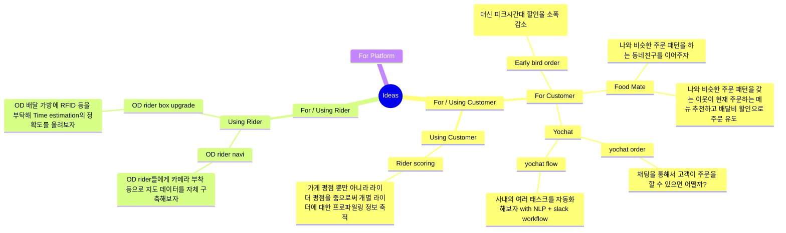

# 2023-wesang-challenge

```mermaid
mindmap
  root((Ideas))
    For / Using Customer
      For Customer
        Early bird order
          식사 시간대 초입과 끝즘에 할인율을 더 높여 수요 분산 (대신 피크시간대 할인율 소폭 감소)
        Food Mate
          나와 비슷한 주문 패턴을 하는 동네친구를 이어주자
          나와 비슷한 주문 패턴을 갖는 이웃이 현재 주문하는 메뉴 추천하고 배달비 할인으로 주문 유도 
        Yochat
          yochat order
            채팅을 통해서 고객이 주문을 할 수 있으면 어떨까?
          yochat flow
            사내의 여러 태스크를 자동화해보자 with NLP + slack workflow
      Using Customer
        Rider scoring
          가게 평점 뿐만 아니라 라이더 평점을 줌으로써 개별 라이더에 대한 프로파일링 정보 축적
    For / Using Rider
      Using Rider
        OD rider navi
          OD rider들에게 카메라 부착 등으로 지도 데이터를 자체 구축해보자
        OD rider box upgrade
          OD 배달 가방에 RFID 등을 부탁해 Time estimation의 정확도를 올려보자
    For Platform
      


    
    
      
      


```
