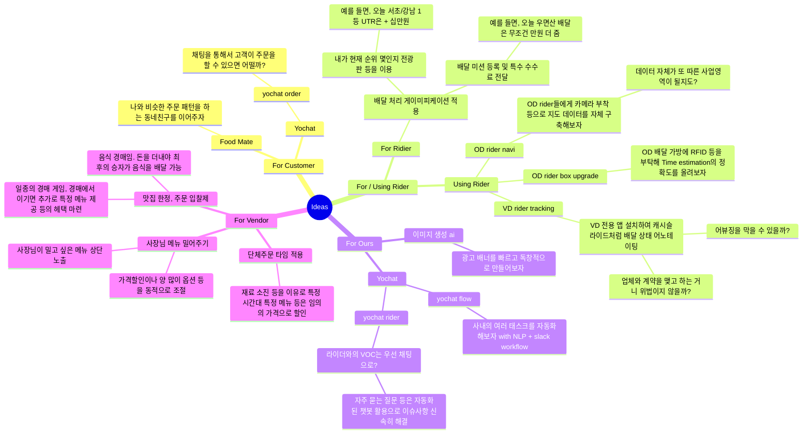

# 2023-wesang-challenge

```mermaid
mindmap
  root((Ideas))
    For Customer
      Food Mate
        나와 비슷한 주문 패턴을 하는 동네친구를 이어주자
      Yochat
        yochat order
          채팅을 통해서 고객이 주문을 할 수 있으면 어떨까?
      
        
    For / Using Rider
      For Ridier
        배달 처리 게이미피케이션 적용
          내가 현재 순위 몇인지 전광판 등을 이용
            예를 들면, 오늘 서초/강남 1등 UTR은 + 십만원
          배달 미션 등록 및 특수 수수료 전달
            예를 들면, 오늘 우면산 배달은 무조건 만원 더 줌
      Using Rider
        OD rider navi
          OD rider들에게 카메라 부착 등으로 지도 데이터를 자체 구축해보자
            데이터 자체가 또 따른 사업영역이 될지도?
        OD rider box upgrade
          OD 배달 가방에 RFID 등을 부탁해 Time estimation의 정확도를 올려보자
        VD rider tracking
          VD 전용 앱 설치하여 캐시슬라이드처럼 배달 상태 어노테이팅
            어뷰징을 막을 수 있을까?
            업체와 계약을 맺고 하는 거니 위법이지 않을까?

    For Ours
      이미지 생성 ai
        광고 배너를 빠르고 독창적으로 만들어보자
      Yochat
        yochat flow
          사내의 여러 태스크를 자동화해보자 with NLP + slack workflow
        yochat rider
          라이더와의 VOC는 우선 채팅으로?
            자주 묻는 질문 등은 자동화된 챗봇 활용으로 이슈사항 신속히 해결

    For Vendor
      사장님 메뉴 밀어주기
        사장님이 밀고 싶은 메뉴 상단노출
        가격할인이나 양 많이 옵션 등을 동적으로 조절
      단체주문 타임 적용
        재료 소진 등을 이유로 특정 시간대 특정 메뉴 등은 임의의 가격으로 할인
      맛집 한정, 주문 입찰제
        음식 경매임. 돈을 더내야 최후의 승자가 음식을 배달 가능
        일종의 경매 게임, 경매에서 이기면 추가로 특정 메뉴 제공 등의 헤택 마련
        
    
    
      
      


```
